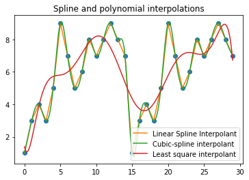

### The Code:

```python
import numpy as np
import matplotlib.pyplot as plt
from scipy.optimize import curve_fit
from scipy.interpolate import interp1d 
```


```python
import pandas as pd
data = pd.read_csv("data.csv") 
print(data.head())


zeroKm = data.loc[:,"0km"] 
print(zeroKm)
plt.plot(zeroKm/100., 'o',label='Water Level at 0 km ')


"""
twoKm = data.loc[:,'2km']
plt.plot(twoKm/100., 'o',label='Water Level at 2 km ')
"""


oneKm = data.loc[:,"1km"]
plt.plot(oneKm/100., 'o',label='Water Level at 1 km ')


threeKm = data.loc[:,"3km"]
#removing anomalies from data 3km
threeKm = threeKm.loc[threeKm != 300]
plt.plot(threeKm/100., 'o',label='Water Level at 3 km ')
plt.title("Water level recorded from sensors")


plt.xlabel ( 'Time (minutes)' )
plt.ylabel ( 'Water level [h]' )
plt.legend()
```

       0km  1km  2km  3km     MBL  position
    0  668  452  419  447  1272.0  0.000000
    1  665  450  421  441   300.0  0.000000
    2  664  451  420  448   300.0  0.118592
    3  667  450  416  300   300.0 -1.000000
    4  666  448  418  443   300.0  0.203387
    0     668
    1     665
    2     664
    3     667
    4     666
         ... 
    85    687
    86    685
    87    685
    88    684
    89    682
    Name: 0km, Length: 90, dtype: int64


    <matplotlib.legend.Legend at 0x7fef3c68f520>


```python
t3 = threeKm.index

poly3 = np.polyfit(t3, threeKm / 100., deg = 5)
polyVal3 = np.polyval(poly3, t3)

print(poly3)
plt.clf()
plt.plot(threeKm/100., 'o',label='Water Level at 3 km ')
plt.plot(t3, polyVal3, color = 'red', label='Interpolant of degree 5')
plt.xlabel ( 'Time (minutes)' )
plt.ylabel ( 'Water level [h]' )
plt.legend()
plt.savefig("data_3km.png")
plt.show()
```

    [ 3.16868207e-09 -5.95317309e-07  3.11436335e-05 -1.02964523e-04
     -1.14521057e-02  4.47965734e+00]


    

    
## Explanation

### Data.csv:
This file contains the data collected at 4 equidistant points along the Bedian canal, with the values in the columns representing the water level at that point, and each row representing a minute in time at which the data was collected. So, each column is a point in the canal and each row is the water level in the canal at those points at a given minute in time, collected over 90 minutes.

### Bedian.py:
Running this file yields us the following graphs:


The above graph titled "Water level recorded from sensors" used the plt.plot function to plot each of the points in the above data file. The data points are colored according to the column they belong to, and the graph thus made gives us an approximate understanding of the water level at each of the equidistant columns.


    
    


For each of the 4 columns in the canal, the water level was measured at 64 different minutes spread over one and a half hour.To be able to interpolate the water level at a given column at a different time or day, we try to find a curve which can represent the underlying trends in our data. Curves on graphs are represented by polynomial equations. Had we chosen a polynomial of degree 64 (degree being the highest power in the polynomial) to represent this data, our curve would pass through each of the collected points. But for interpolation to make sense, we fit our data to a polynomial of degree 5, so that when we try to get an estimate at another time on another day, it wouldn't be too far off from our generalized curve. Which of course, is generalized since we didn't overfit it pass through all 64 points.


## The Code (pt 2)


```python
# -*- coding: utf-8 -*-
"""
Created on Wed Mar  9 08:59:33 2022

@author: zahra
"""

#Labs polynomial and spline interpolation
import matplotlib.pyplot as plt
import numpy as np 
from scipy import interpolate
from scipy.interpolate import interp1d 
from scipy.optimize import curve_fit

#Given a set of points (x_i, y_i)
y = [1,3,4,3,5,9,7,5,6,8,7,8,9,8,7,1,3,4,3,5,9,7,5,6,8,7,8,9,8,7]
n = len(y)
x = range(0, n)
xfit = np.arange(0, n-1, 0.001)
plt.plot(x , y, 'o')
plt.plot(x , y, label='Linear Spline Interpolant')

f = interpolate.CubicSpline(x, y, bc_type='natural')
y_= f(xfit) # evaluating the cubic spline for x_fit points
plt.plot(xfit , y_, label='Cubic-spline interpolant')

'''
#so, what does it help to know how to represent a polynomial in monomial basis? or as a matter of fact, any other basis
degree = n-1
A = np.vander(x,degree+1)

A = np.fliplr(A)
print(A)
#Ac = y, c = A-1y
coeffs = np.linalg.solve(A, y)
print(coeffs)

#polynomial evaluation
interp_m = 500
interp_x = np.linspace(0, n, interp_m)
interp_y = np.zeros(interp_m)
for ind, ix in enumerate(interp_x):
    interp_y[ind] = np.sum(coeffs * ix ** np.arange(0, degree+1))

plt.plot(interp_x, interp_y, label='Monomial basis interpolant order 4')
'''


#But then there is another function in numpy which also finds the curve. 
#So, whats the difference?
#least squares! 
poly = np.polyfit(x, y, deg = 10)
polyVal = np.polyval(poly, xfit)

plt.plot(xfit, polyVal, label='Least square interpolant')

plt.title("Spline and polynomial interpolations")

plt.legend()
```


    <matplotlib.legend.Legend at 0x7f3c2a699be0>


    

    


## The Explanation (pt 2)

In the above graph we observe 2 more methods that can be used for interpolation: spline and least squares. 

In spline interpolation, the equation of the curve we come up with to describe our data is a **piecewise function**, which basically means that we take each pair of successive points and describe a curve for them, and then the cumulative of all these curves is the resultant curve of our overall data.
Lineral Spline interpolation as the name suggests uses a linear function to describe how our curve exists between each pair of data points, and as we can observe, the orange curve representing linear spline interpolation in the graph is a series of straight lines connecting each data point to the next.
Cubic spline interpolation likewise uses a cubic function, which is a function who's equation's highest exponent is 3, to describe the curve between each pair of succesive data points. This gives us smoother, continuous curves instead of straight and discontinuous lines passing through the data points.

In least squares interpolation, our descriptive curve is not piecewise and it also does not pass through each of the data points. This is because it is found as a result of minimizing an error function over the set of data points. Essentially, it is what we get when we arbitrarily pass a curve that roughly passes "through" the general area of our data, then adjust it in a way that it reduces a function that we call the "least square" function. This function measures the distance between the y value of our curve at a given x, against the actual y value of the data at that x. Finding a curve that results in a minimum value for the least squares at each data point gives us our interpolation curve. 

So which method is more useful? Which one's more accurate? It depends on the problem that we're trying to solve. If our data is likely to have noise (unnecessary data) or outliers (aberrant data) than accounting for such errors using an approximation curve such as a least squares interpolant could be desired. On the other hand, if our data is regular and unchanging over repeated data collections, using a cubic spline might be a better way to determine what the y value for an unknown x0 between 2 existing and known data points x1 and x2 might be.
